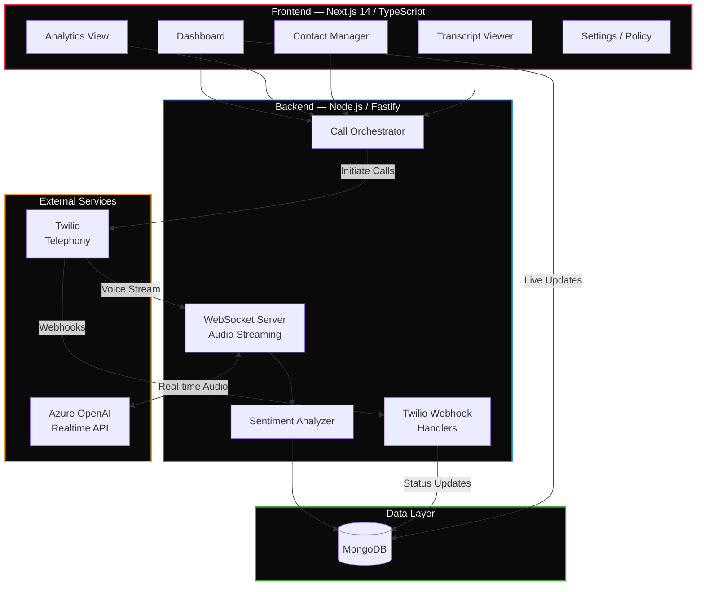

<div align="center">

# VocaMind

**AI-powered outbound calling with real-time sentiment analysis and conversation insights.**

[](https://nextjs.org/)
[](https://www.typescriptlang.org/)
[](https://www.fastify.io/)
[](https://www.mongodb.com/)
[](https://www.twilio.com/)
[](https://azure.microsoft.com/)
[](LICENSE)

[Features](#features) · [Architecture](#architecture) · [Quick Start](#quick-start) · [API Reference](#api-reference) · [Contributing](#contributing)

</div>

---

## About

VocaMind is a voice communication platform that automates outbound calling campaigns while providing real-time AI-powered conversations, live sentiment analysis, and comprehensive analytics dashboards. Upload a CSV of contacts, launch a campaign, and watch as VocaMind handles conversations in 6 languages — with every call scored, transcribed, and analyzed.

---

## Features

| Feature | Description |
|:--------|:------------|
| **AI Voice Conversations** | Natural voice interactions powered by Azure OpenAI Realtime API |
| **Bulk Outbound Calls** | Upload CSV contact lists and launch automated calling campaigns via Twilio |
| **Multi-Language Support** | English, Spanish, Chinese, Russian, Haitian Creole, and Korean |
| **Live Sentiment Analysis** | Real-time sentiment scoring with positive/negative keyword tracking |
| **Call Recording** | Automatic recording with transcription and status tracking |
| **Analytics Dashboard** | Interactive charts, call metrics, and performance tracking with Recharts |
| **Interactive Transcripts** | Chat-style transcript viewer with color-coded sentiment indicators |
| **Data Export** | Export call data and analytics for external analysis |
| **Contact Management** | Upload, organize, and manage contact lists |
| **Policy Engine** | Configure call guidelines and conversation policies |

---

## Architecture



### Call Flow

```
┌─────────┐    ┌─────────┐    ┌───────────┐    ┌──────────┐
│  Upload  │───▶│ Twilio  │───▶│  Azure    │───▶│ Sentiment│
│  CSV     │    │ Dials   │    │  OpenAI   │    │ Analysis │
│  Contacts│    │ Contact │    │  Converses│    │ & Store  │
└─────────┘    └─────────┘    └───────────┘    └──────────┘
                    │                                │
                    ▼                                ▼
              ┌──────────┐                    ┌──────────┐
              │ Recording│                    │ Dashboard│
              │ & Status │                    │ & Export │
              └──────────┘                    └──────────┘
```

---

## Quick Start

### Prerequisites

- **Node.js** 18+
- **MongoDB** instance (local or Atlas)
- **Twilio** account with a phone number
- **Azure OpenAI** account with Realtime API access

### 1. Clone and Install

```bash
git clone https://github.com/yourusername/vocamind.git
cd vocamind

# Backend
cd Backend && npm install

# Frontend
cd ../Frontend && npm install
```

### 2. Configure Environment

**Backend** — `Backend/.env`:

```env
TWILIO_ACCOUNT_SID=your_twilio_account_sid
TWILIO_AUTH_TOKEN=your_twilio_auth_token
TWILIO_PHONE_NUMBER=your_twilio_phone_number
AZURE_OPENAI_API_KEY=your_azure_openai_key
AZURE_OPENAI_ENDPOINT=your_azure_openai_endpoint
MONGODB_URI=your_mongodb_connection_string
PORT=5050
```

**Frontend** — `Frontend/.env.local`:

```env
MONGODB_URI=your_mongodb_connection_string
NEXTAUTH_SECRET=your_nextauth_secret
NEXT_PUBLIC_API_URL=http://localhost:5050
```

### 3. Run

```bash
# Terminal 1 — Backend
cd Backend
npm run dev          # → http://localhost:5050

# Terminal 2 — Frontend
cd Frontend
npm run dev          # → http://localhost:3000
```

---

## Project Structure

```
VocaMind/
├── Backend/                        # Fastify API Server
│   ├── index.js                   # Main entry point
│   ├── server.js                  # Fastify config + routes
│   ├── demo.js                    # Demo/testing utilities
│   ├── test-sentiment.js          # Sentiment analysis tests
│   └── phone_numbers.csv          # Sample contact data
│
└── Frontend/                       # Next.js Application
    ├── app/
    │   ├── api/
    │   │   ├── calls/             # Call management endpoints
    │   │   ├── contacts/          # Contact CRUD
    │   │   ├── conversations/     # Conversation data
    │   │   └── dashboard/         # Dashboard stats
    │   ├── dashboard/             # Dashboard pages
    │   └── page.tsx               # Login / landing
    │
    ├── components/
    │   ├── analytics/             # Charts and sentiment views
    │   ├── ui/                    # shadcn/ui component library
    │   └── app-layout.tsx         # Main layout shell
    │
    └── lib/
        ├── auth-context.tsx       # Auth state management
        ├── mongodb.ts             # Database connection
        └── utils.ts               # Helpers
```

---

## API Reference

### Core Backend Endpoints

| Method | Endpoint | Description |
|:-------|:---------|:------------|
| `GET` | `/` | Health check |
| `POST` | `/batch-calls` | Launch batch calling campaign from CSV |
| `GET` | `/call-status-summary` | Active call statistics |

### Twilio Webhooks

| Method | Endpoint | Description |
|:-------|:---------|:------------|
| `POST` | `/call-status` | Call status change callbacks |
| `POST` | `/gather-input` | DTMF tone input processing |
| `POST` | `/recording-status` | Recording completion callbacks |
| `POST` | `/fallback` | Error fallback handler |
| `WS` | `/media-stream` | Real-time audio streaming (WebSocket) |

### Frontend API Routes

| Endpoint | Description |
|:---------|:------------|
| `/api/calls` | Call data management |
| `/api/contacts` | Contact list CRUD |
| `/api/conversations` | Conversation transcripts |
| `/api/dashboard/stats` | Aggregated dashboard metrics |
| `/api/generate-suggestions` | AI-generated follow-up suggestions |

### CSV Format for Batch Calls

```csv
phone_number,language,name
+15551234567,en,John Doe
+15552345678,es,Maria Rodriguez
+15553456789,zh,李明
```

Supported languages: `en` · `es` · `zh` · `ru` · `ht` · `ko`

---

## Tech Stack

### Frontend

| Layer | Technology |
|:------|:-----------|
| Framework | Next.js 14 (App Router) |
| Language | TypeScript |
| Styling | Tailwind CSS |
| UI Components | shadcn/ui |
| Charts | Recharts |
| State | React Context |
| Database Access | MongoDB (via Next.js API routes) |

### Backend

| Layer | Technology |
|:------|:-----------|
| Runtime | Node.js (ES modules) |
| Framework | Fastify |
| Database | MongoDB |
| Telephony | Twilio (calls, recording, DTMF) |
| AI / Voice | Azure OpenAI Realtime API |
| Real-time | WebSocket (audio streaming) |
| Sentiment | sentiment (npm) |
| CSV Parsing | csv-parse |
| HTTP Client | Axios |

---

## Contributing

1. Fork the repository
2. Create your feature branch → `git checkout -b feat/new-feature`
3. Commit your changes → `git commit -m "feat: add new feature"`
4. Push to the branch → `git push origin feat/new-feature`
5. Open a Pull Request

---

## License

Licensed under the [ISC License](LICENSE).

---

<div align="center">

**[Back to Top](#vocamind)**

</div>
